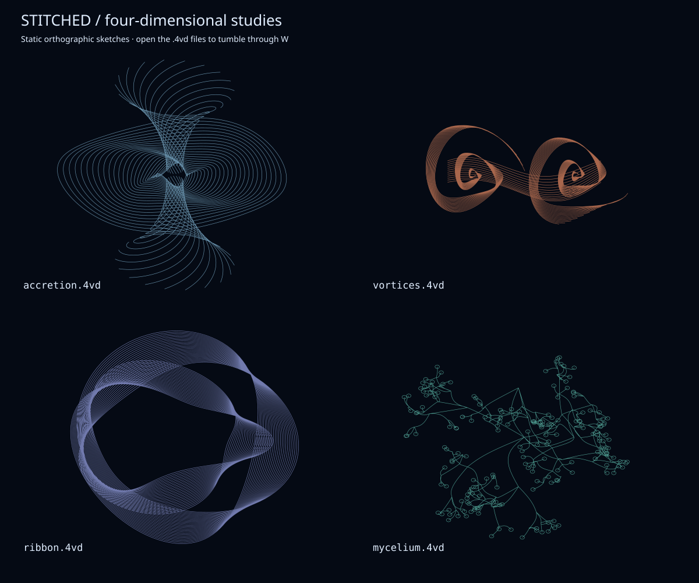

# Stitched / four-dimensional studies

Four objects inspired by the `*_stitched` backgrounds: luminous accretion
disks, polar jets, and curling star trails. These are artistic geometries,
not physical simulations. Unlike the regular polytopes and gridded surfaces
in the original samples, they use flowing strands, open curves, and branches.
All four use a varying W coordinate.



Run these from the repository root after building 4va:

```sh
build/4va -lc LightSkyBlue -s200 -zd900 -wd900 -yz0.12 -xw0.16 data/accretion.4vd
build/4va -lc Coral -s210 -zd900 -wd900 -xy0.10 -zw0.22 data/vortices.4vd
build/4va -lc MediumPurple -s210 -zd900 -wd900 -xz0.13 -yw0.21 data/ribbon.4vd
build/4va -lc Aquamarine -s210 -zd900 -wd900 -xz0.18 -xw0.14 data/mycelium.4vd
```

- **Accretion spindle:** layered disk rings around twin flaring, helical jets.
- **Binary vortices:** two tightly wound spiral bundles joined by tidal streams.
- **Folded light ribbon:** a closed, pleated ribbon winding twice around its
  center and three times through Z/W; watch the folds separate during rotation.
- **Cosmic mycelium:** seven recursively branching arms ending in tiny halos.

The viewer draws one line color per object; the backgrounds' glow and multiple
colors are inspiration, not features encoded in these files. The SVG is a
static orthographic sketch, so its angle differs from the live animation.
The objects fit inside a radius of 1.12 in four dimensions. The larger viewing
distances above keep perspective gentle; try `-np` for an orthographic view.
Add `-nd` to keep a viewer in the foreground and stop it with Ctrl-C.

Regenerate the four files and preview with `python3 tools/cosmic.py`.
Use `python3 tools/cosmic.py --check` to verify reproducibility without writing.
The generator uses only Python's standard library and a fixed random seed.
