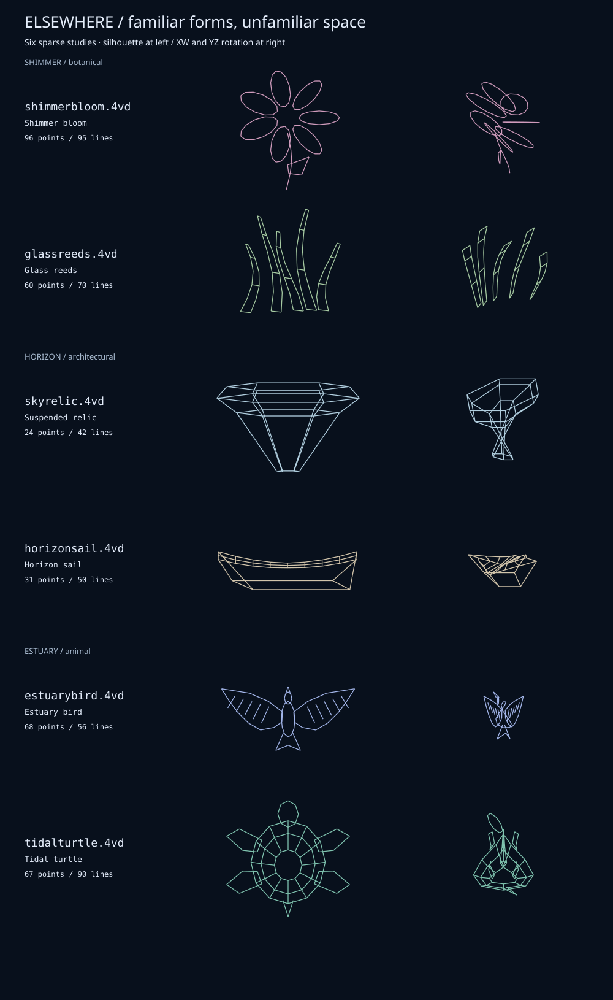

# Elsewhere / familiar forms, unfamiliar space

Six sparse studies between the minimal frameworks and the dense cosmic strands.
The starting points are *Annihilation*, *Oblivion*, and the silhouettes of birds
and turtles: uncanny plants, suspended architecture, and quiet animal forms.
These are original interpretations of those moods, rather than replicas of
movie props or creatures.



Contours, folds, and a few structural ribs carry the shapes. There are no node
markers or central spoke hubs. Each object spans all four dimensions, with W
shaping its petals, panels, wings, or shell. Rotation gradually pulls the familiar
silhouette into something stranger. These are static geometries tumbling in 4D;
the bird does not perform a simulated wingbeat.

## Shimmer / botanical

| File | Points / lines | Form |
| --- | --- | --- |
| [shimmerbloom.4vd](shimmerbloom.4vd) | 96 / 95 | Seven hollow petals around an empty throat, a bent stem, and one leaf. The petal outlines rise and fall through W at different phases. |
| [glassreeds.4vd](glassreeds.4vd) | 60 / 70 | Five unequal, gently bent blades with a handful of crossbars. Each blade occupies a different depth in Z and W. |

```sh
build/4va -np -lc Plum -xw0.12 -yz0.04 data/shimmerbloom.4vd
build/4va -np -lc PaleGreen -yw0.14 -xz0.05 data/glassreeds.4vd
```

## Horizon / architectural

| File | Points / lines | Form |
| --- | --- | --- |
| [skyrelic.4vd](skyrelic.4vd) | 24 / 42 | A broad, faceted crown tapering into a suspended keel. Six-sided sections shift through W as they descend. |
| [horizonsail.4vd](horizonsail.4vd) | 31 / 50 | A thin, ribbed canopy above an offset four-cornered panel. A wave in W gives the spare structure an unexpected twist. |

```sh
build/4va -np -lc LightSkyBlue -xw0.10 -yz0.09 data/skyrelic.4vd
build/4va -np -lc Wheat -yw0.14 -xz0.07 data/horizonsail.4vd
```

## Estuary / animal

| File | Points / lines | Form |
| --- | --- | --- |
| [estuarybird.4vd](estuarybird.4vd) | 68 / 56 | Swept wings, five feather strokes per side, a narrow body, beak, and forked tail. Opposite wings extend toward opposite W directions. |
| [tidalturtle.4vd](tidalturtle.4vd) | 67 / 90 | Three shell contours joined by ribs, four paddle flippers, a small head, and a pointed tail. The shell undulates through W. |

```sh
build/4va -np -lc LightSteelBlue -xw0.10 -yz0.04 data/estuarybird.4vd
build/4va -np -lc Aquamarine -yw0.10 -xz0.04 data/tidalturtle.4vd
```

## Viewing and regeneration

Run these commands from the repository root after building 4va. The slow
rotations let the silhouettes linger. `-np` removes perspective; substitute
`-zd900 -wd900` for gentle perspective. Try `-lw2` for bolder outlines. Add
`-nd` to stay in the foreground and stop with Ctrl-C.

The SVG shows two orthographic poses per object, without vertex dots: a slight
tilt from the saved silhouette, then an additional XW/YZ rotation. The viewer
uses a single line color per object. Disconnected contours are intentional;
this is line art, not a watertight surface model.

Generate the files and preview with `python3 tools/elsewhere.py`, or verify
them without writing with `python3 tools/elsewhere.py --check`. The generator
uses the existing `cosmic.py` and `minimal.py` helpers, requires only Python's
standard library, and checks that each model spans 4D and stays under 150 edges.

Other collections: [Originals](ORIGINALS.md) · [Small](MINIMAL.md) ·
[Stitched / cosmic studies](COSMIC.md).
