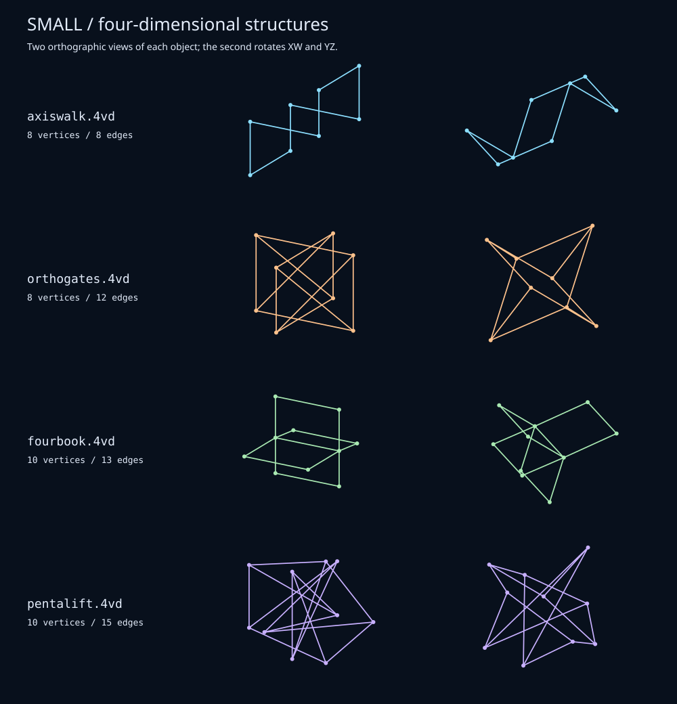

# Small / four-dimensional structures

Four sparse constructions, with only 8–15 edges apiece. These are open
frameworks, not complete polytope skeletons or sampled surfaces. Their vertices
span four dimensions: no rotation can put the whole object into a 3D subspace.



| File | Vertices / edges | Construction |
| --- | --- | --- |
| `axiswalk.4vd` | 8 / 8 | One closed path: step along +X, +Y, +Z, +W, then −X, −Y, −Z, −W. Four independent edge directions in just eight strokes. |
| `orthogates.4vd` | 8 / 12 | A square in XY and a square in ZW, with matching corners connected. A cube graph with a different spatial arrangement: the two square planes have no shared direction. |
| `fourbook.4vd` | 10 / 13 | Four rectangular pages sharing one spine. Their outward directions span YZW, so the pages cannot all fit in ordinary 3D. |
| `pentalift.4vd` | 10 / 15 | A pentagon in XY, a pentagram in ZW, and five bridges: the Petersen graph embedded in four dimensions. Projected crossings are not extra vertices. |

Each file is centered, normalized, and saved in an oblique pose so its initial
view exposes more of the structure. The diagrams show the saved pose and a
second pose rotated through XW and YZ. Dots mark vertices in the preview only.

Try these from the repository root:

```sh
build/4va -np -lc LightSkyBlue -xw0.35 -yz0.13 data/axiswalk.4vd
build/4va -np -lc PeachPuff -xw0.25 -yw0.17 data/orthogates.4vd
build/4va -np -lc PaleGreen -yw0.30 -xz0.12 data/fourbook.4vd
build/4va -np -lc Plum -xw0.23 -zw0.17 data/pentalift.4vd
```

`-np` makes the relationships easier to follow without perspective distortion.
For gentle perspective, replace it with `-zd900 -wd900`. Add `-nd` to run in
the foreground and close with Ctrl-C.

Regenerate with `python3 tools/minimal.py`; verify with
`python3 tools/minimal.py --check`. The generator reuses the first batch's
`Shape` writer from `tools/cosmic.py` and checks affine dimension and duplicate
edges as well as the writer's coordinate/index validation. No extra packages
are required.
