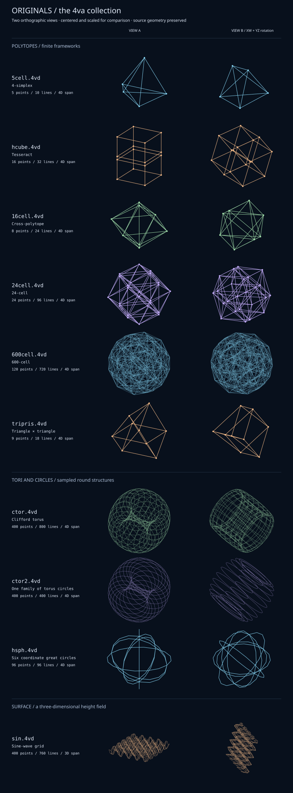

# Originals / the 4va collection

The ten original sample objects, grouped by structure. The polytopes are finite
frameworks; the round examples sample circles and a torus; the wave is a height
field in ordinary 3D. All but `sin.4vd` span four dimensions.



The preview reads the actual files and shows two oblique orthographic views of
each. Objects are centered and scaled individually for comparison, so apparent
size does not indicate their original scale. View B adds rotations in XW and YZ
to view A. Dots mark vertices on the smaller frameworks; crossings elsewhere
are not additional vertices. The source files are unchanged.

## Polytopes

The numbers in names such as “24-cell” count three-dimensional boundary cells,
not the points or lines drawn by the viewer. 4va displays their wireframes.

| File | Points / lines | What to look for |
| --- | --- | --- |
| [5cell.4vd](5cell.4vd) | 5 / 10 | The 4-simplex: five vertices, every pair connected. The smallest framework here, extending the triangle/tetrahedron pattern into 4D. |
| [hcube.4vd](hcube.4vd) | 16 / 32 | The tesseract, or 4D hypercube. Two cubes at opposite W coordinates, joined at corresponding corners. |
| [16cell.4vd](16cell.4vd) | 8 / 24 | The 4D cross-polytope. Vertices lie on the positive and negative coordinate axes; each connects to every vertex except itself and its opposite. |
| [24cell.4vd](24cell.4vd) | 24 / 96 | Vertices have two nonzero coordinates, each ±1/√2. Eight edges meet at every vertex, giving a denser, balanced framework. |
| [600cell.4vd](600cell.4vd) | 120 / 720 | The densest original polytope: twelve edges meet at each vertex. Slow rotations reveal its layered symmetry. |
| [tripris.4vd](tripris.4vd) | 9 / 18 | A triangular duoprism: the Cartesian product of a triangle in XY and a triangle in ZW. Follow three copies of either triangle linked by the other. |

```sh
build/4va -np -lc LightSkyBlue -xw0.30 -yz0.13 data/5cell.4vd
build/4va -np -lc PeachPuff -xw0.25 -yw0.17 data/hcube.4vd
build/4va -np -lc PaleGreen -xw0.25 -yz0.15 data/16cell.4vd
build/4va -np -lc Plum -xw0.20 -zw0.13 data/24cell.4vd
build/4va -np -lc LightSkyBlue -xw0.10 -yz0.07 data/600cell.4vd
build/4va -np -lc PeachPuff -xw0.25 -yw0.17 data/tripris.4vd
```

## Tori and circles

These are polygonal samples of round structures. Their point counts describe
stored samples, rather than corners of a solid.

| File | Points / lines | What to look for |
| --- | --- | --- |
| [ctor.4vd](ctor.4vd) | 400 / 800 | A 20 × 20 Clifford torus: `(cos u, sin u, cos v, sin v)`. Both families of circles are connected, making a closed grid in 4D. |
| [ctor2.4vd](ctor2.4vd) | 400 / 400 | The same points with only one family of edges: twenty separate 20-segment circles. “Cut” means omitted grid lines, not an opening cut into the surface. |
| [hsph.4vd](hsph.4vd) | 96 / 96 | Six 16-segment great circles, one in each coordinate plane: XY, XZ, XW, YZ, YW, ZW. A sparse outline of a hypersphere, not a complete surface mesh. The circles store separate copies of shared axis points. |

```sh
build/4va -np -s175 -lc PaleGreen -xw0.20 -yw0.13 data/ctor.4vd
build/4va -np -s175 -lc Plum -xw0.20 -yw0.13 data/ctor2.4vd
build/4va -np -lc LightSkyBlue -xw0.25 -yz0.13 data/hsph.4vd
```

Try the two torus files with the same settings to see what removing one family
of edges does to the apparent shape. Their intrinsic surface is two-dimensional,
but their sampled points span all four ambient coordinate directions.

## Wave surface

| File | Points / lines | What to look for |
| --- | --- | --- |
| [sin.4vd](sin.4vd) | 400 / 760 | An open 20 × 20 grid with height `y = (sin(15x) + sin(15z)) / 5`, sampled from −1 to 0.9 on X and Z. Every W coordinate is zero: this is a 3D wave surface. |

```sh
build/4va -np -s175 -lc PeachPuff -xz0.15 -yz0.25 data/sin.4vd
```

This command rotates within XYZ to emphasize the height field. Adding an XW
rotation moves its 3D subspace through 4D, but does not make the geometry itself
span four dimensions.

## Viewing and reproducing the sheet

Run the commands from the repository root after building 4va. `-np` disables
perspective to keep the structures easy to follow. For gentle perspective,
replace it with `-zd900 -wd900`. Add `-nd` to stay in the foreground and stop
with Ctrl-C. Live views begin at the files' original orientations; the SVG
uses fixed oblique poses to reveal more structure immediately.

Regenerate just the preview with `python3 tools/originals.py`, or verify it
and compare all ten originals with reconstructed formulas without writing using
`python3 tools/originals.py --check`. The script validates
section sizes, coordinates, edge indices, and measures each object's affine
dimension. It uses the rotation/rank helpers in `tools/minimal.py` and requires
only Python's standard library. It accepts the original `name=triprism` spelling
in `tripris.4vd` as well as the usual `n=` field.

## Formula reconstruction and provenance

**The historical `.4vd` files in this collection were not created by
`tools/originals.py`.** Its formula generator is a modern reconstruction of
their geometry, not recovered historical authoring code.

Generate a separate set of all ten objects with:

```sh
python3 tools/originals.py --output-dir /tmp/4va-originals
python3 tools/originals.py --output-dir /tmp/4va-originals --check
```

This mode builds coordinates and edges directly from formulas without reading
the original `.4vd` files. It does not generate a preview or overwrite `data/`.
The second command verifies the reconstructed files byte for byte without
writing. The default `--check` instead compares the historical objects with
the formulas, allowing reordered vertices/edges and coordinate rounding within
a Euclidean distance of `1e-5`; it also checks the historical preview.

| Objects | Reconstructed recipe |
| --- | --- |
| `5cell` | Regular simplex of edge length 1.8, using square-root coordinates in its original orientation. |
| `hcube` | All combinations of four coordinates ±½. |
| `16cell` | The eight signed coordinate unit vectors. |
| `24cell` | Choose two nonzero coordinates, each ±1/√2. |
| `600cell` | Eight axis points, sixteen points with coordinates ±½, and 96 signed even permutations of `(φ/2, 1/2, 1/(2φ), 0)`, where `φ = (1+√5)/2`. |
| `tripris` | Cartesian product of two equilateral triangles of side length 1. |
| `hsph` | Six coordinate-plane circles sampled at 16 equally spaced angles, retaining separate copies of shared axis points. |
| `ctor`, `ctor2` | A 20 × 20 product of circles, with both edge families or only one. |
| `sin` | The original sine height formula on a 20 × 20 open grid. |

For the six polytopes, edges join nearest-neighbor vertices. Circle and grid
edges follow their sample indices. Output preserves the original geometric
scale, but vertex order, edge order/direction, decimal formatting, and object
name syntax may differ. In particular, reconstructed `tripris` uses `n=`.
Geometric equivalence is the target, not a byte-identical historical artifact.

Three original C generators survive: `src/ctorus.c`, `src/cutctorus.c`, and
`src/4vdmake.c`. Running their executables with `20 20` reproduces `ctor.4vd`,
`ctor2.4vd`, and `sin.4vd`, respectively, apart from signed-zero formatting in
the tested build. Their formulas are credited to Matt Welsh. For the other
seven, the formulas and connectivity were verified against the stored files;
the original authoring tools or manual processes have not been recovered.

The original objects and generators are part of Matt Welsh's 4va distribution;
see the repository's license and original source notices.

Other collections: [Stitched / cosmic studies](COSMIC.md) ·
[Small / four-dimensional structures](MINIMAL.md).
